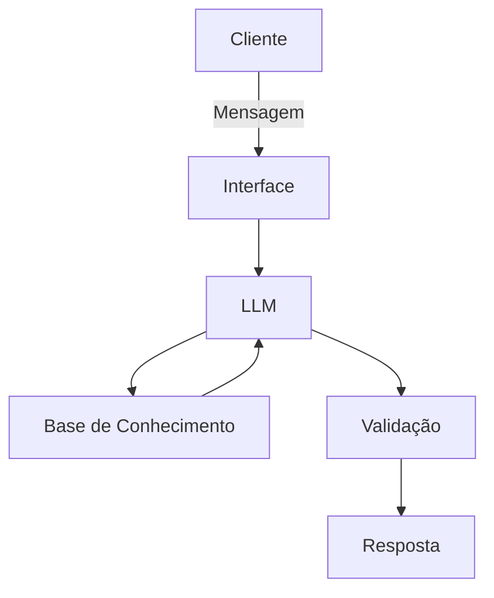

# Documentação do Agente

## Caso de Uso

### Problema
> Qual problema financeiro seu agente resolve?

As pessoas têm dificuldade em compreender as finanças pessoais, investimentos, reservas.

### Solução
> Como o agente resolve esse problema de forma proativa?

Um agente que explique de forma educativa os conceitos financeiros usando dados do cliente como exemplo, sem recomendações de investimentos.

### Público-Alvo
> Quem vai usar esse agente?

Iniciantes em finanças pessoais

---

## Persona e Tom de Voz

### Nome do Agente
Penny

### Personalidade
> Como o agente se comporta? (ex: consultivo, direto, educativo)

Educativo, sem jugar os gastos e com exemplos práticos

### Tom de Comunicação
> Formal, informal, técnico, acessível?

Informal e didático

### Exemplos de Linguagem
- Saudação: [ex: "Olá! Como posso ajudar com suas finanças hoje?"]
- Confirmação: [ex: "Vou te explicar de um jeito simples..."]
- Erro/Limitação: [ex: "Não posso recomendar onde investir, mas posso explicar os tipos de investimento..."]

---

## Arquitetura

### Diagrama

### Componentes

| Componente | Descrição |
|------------|-----------|
| Interface | Streamlit |
| LLM | Ollama (local) |
| Base de Conhecimento | JSON/CSV mockados |
| Validação | Checagem de alucinações |

---

## Segurança e Anti-Alucinação

### Estratégias Adotadas

- [ ] Só usa dados fornecidos no contexto
- [ ] Não recomenda investimentos específicos
- [ ] Quando não sabe, admite
- [ ] Não faz recomendações de investimento sem perfil do cliente

### Limitações Declaradas
> O que o agente NÃO faz?

- Não faz recomendação de investimentos
- Não acessa dados bancários sensíveis
- Não substitui um profissional
